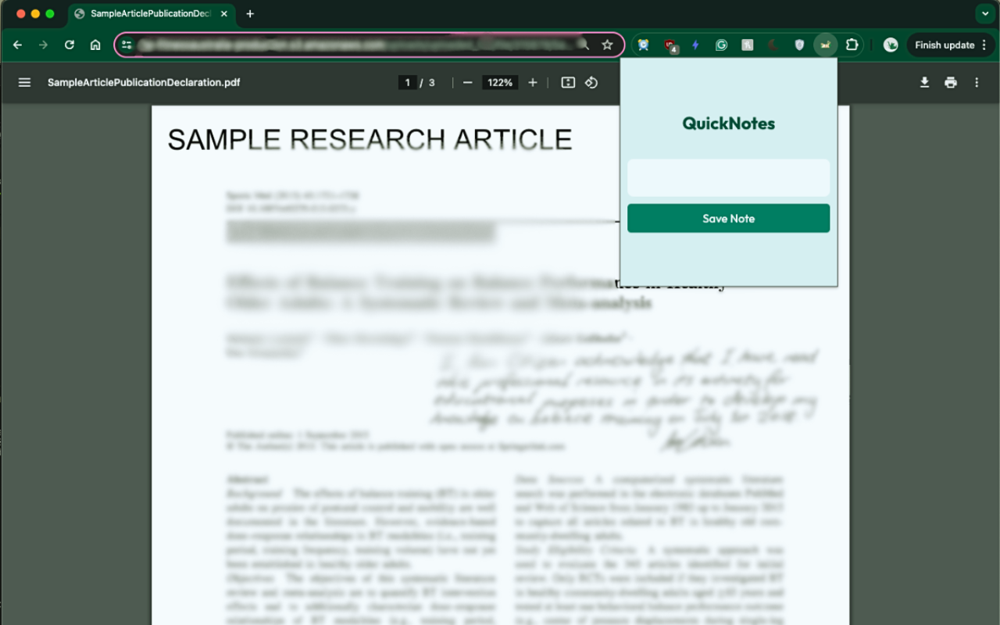
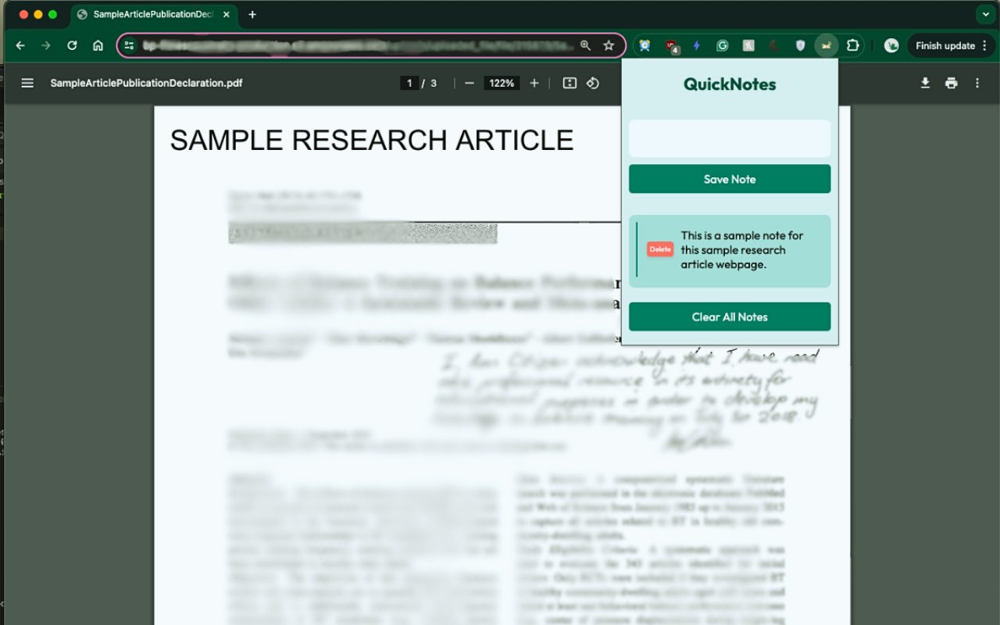
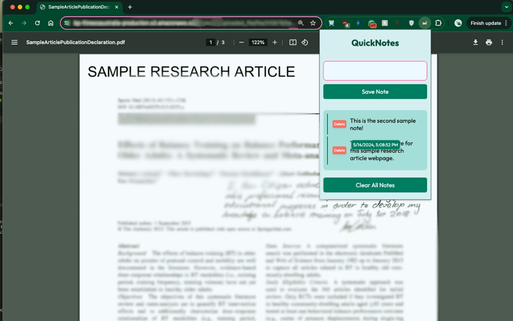

# Quick Notes Chrome Extension

## Overview
Quick Notes is a powerful Chrome extension designed for professionals and students alike, allowing users to seamlessly save and manage notes linked to specific web pages. This tool is indispensable for those who engage in extensive online research, providing a swift and intuitive method to annotate and revisit key information across the web.

To download, install the extension here: [Quicknotes Chrome Extension Page](https://chromewebstore.google.com/detail/quick-notes/kbiajefahoihmligpokjjlmapknnonlc?authuser=1)

## Features
- **Save Notes Quickly**: Users can save notes with a single click on the extension's popup or by pressing the Enter key when focused on the text input area.
- **Manage Notes**: Notes can be viewed, deleted, or cleared per website, providing easy management and retrieval of information.
- **Automatic URL Recognition**: The extension automatically recognizes the URL of the current tab and saves notes specific to each website.
- **Note Timestamps**: Each note is saved with a timestamp, allowing users to see when the note was created.

## Demo Images

## Project Structure
- **locales/en/messages.json**: Contains all user-facing strings, facilitating localization and internationalization.
- **css/style.css**: Defines the styling of the popup interface, ensuring a user-friendly experience.
- **html/base.html**: Serves as a template for other HTML files, promoting code reusability and maintainability.
- **html/popup.html**: The main user interface for the extension, where users interact with note functions.
- **icons/icon.png**: The icon used for the Chrome extension toolbar, visible to users.
- **js/popup.js**: Contains the core functionality for note saving, loading, and UI interactions.
- **manifest.json**: Configures essential settings for the Chrome extension, including permissions, linked files, and behaviors.

## Installation
To install the Quick Notes extension:
1. Download the repository and unzip it.
2. Open Chrome and navigate to `chrome://extensions/`.
3. Enable Developer Mode at the top right.
4. Click on "Load unpacked" and select the unzipped folder.
5. The extension will now be available in your Chrome toolbar.

## Usage
Click the Quick Notes icon in your Chrome toolbar to open the popup interface. Here, you can type a note and either press the Enter key or click the save button to store your note linked to the current webpage.

## Design Considerations
- **Security and Privacy**: The extension uses Chrome's local storage to ensure that all data remains on the user's device, enhancing security and privacy.
- **Performance Optimization**: By loading notes asynchronously and using efficient DOM manipulation, the extension maintains high performance even with extensive use.
- **User Experience**: The UI is designed to be intuitive and minimalistic, ensuring ease of use without extensive training.

## Future Enhancements
- **Cloud Syncing**: Future versions could include syncing notes across devices using Google Drive or other cloud services.
- **Rich Text Support**: Enabling rich text formatting will allow users to save notes with different styles and attachments.

## Contributions
Contributions are welcome! If you have ideas for new features or notice any bugs, please open an issue or submit a pull request.

## License
This project is licensed under the MIT License - see the LICENSE file for details.
